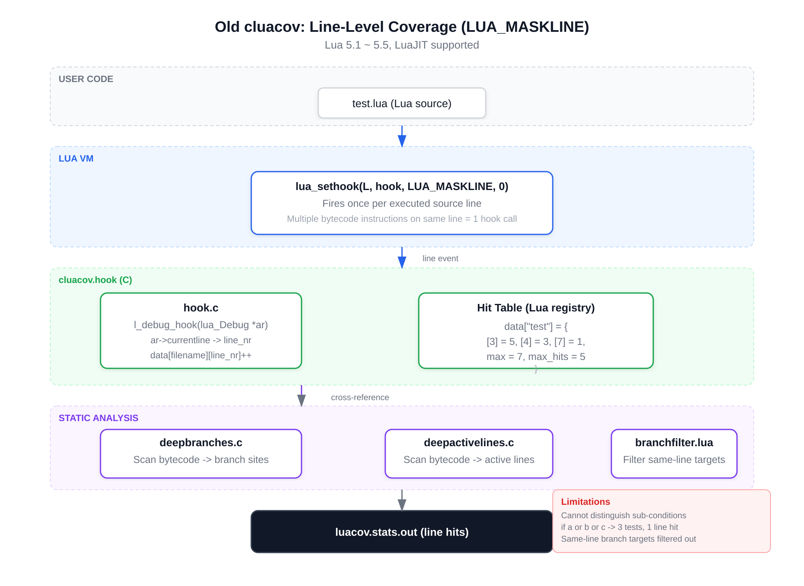
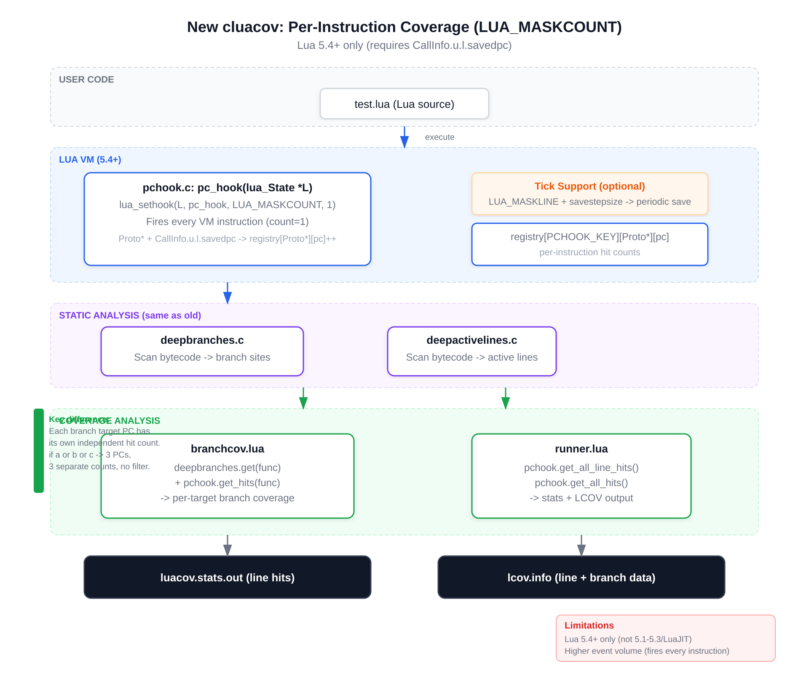
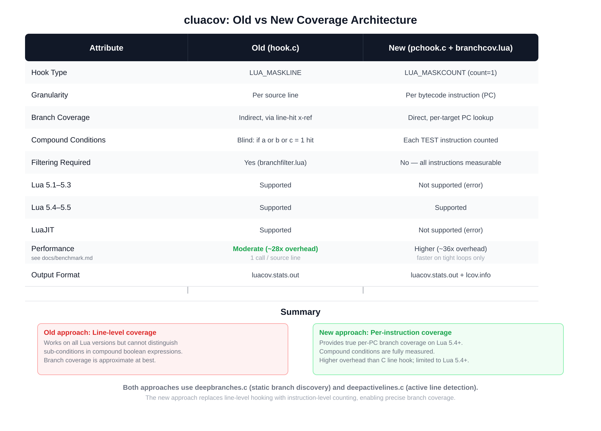

# cluacov

 

C extensions for [LuaCov](https://github.com/lunarmodules/luacov), improving
performance and reducing number of lines incorrectly marked as missed.

To install using [LuaRocks](https://luarocks.org/) run
`luarocks install cluacov`. cluacov depends on luacov, so that running this
command is enough to set up luacov with extensions.

See [docs/getting-started.md](docs/getting-started.md) for a quick-start guide
on how to add cluacov to your project.

`cluacov.deepbranches` analyzes Lua bytecode to discover branch sites within
functions. It reports conditional branches (`if`/`elseif`/`and`/`or`), numeric
`for` loops, and generic `for` iterators. Combined with LuaCov line-hit data,
it enables branch coverage analysis with LCOV/HTML report generation.

See [docs/branch-coverage.md](docs/branch-coverage.md)
([中文版](docs/branch-coverage-zh.md)) for a detailed guide
on how branch coverage works, the API reference, and how to generate reports.

## Architecture

cluacov has two coverage collection approaches, depending on the Lua version:

### Old approach (Lua 5.1–5.5, LuaJIT)

The old approach uses `LUA_MASKLINE` to fire a debug hook once per executed
source line. It cross-references line hits with static branch discovery
(`deepbranches.c`) to approximate branch coverage. A `branchfilter.lua` module
filters out branches whose targets share the same source line, which cannot
be distinguished at line granularity.

### New approach (Lua 5.4+ only)

The new approach uses `LUA_MASKCOUNT` with count=1 to fire a C-level hook on
**every bytecode instruction**. Each instruction's program counter (PC) is
recorded independently, so every branch target has its own hit count. Combined
with `branchcov.lua`, this provides true per-instruction branch coverage
without filtering. An optional "tick" mode enables periodic stats saving for
long-running processes.

### Comparison

| Aspect | Old (hook.c) | New (pchook.c + branchcov.lua) |
|---|---|---|
| **Hook type** | `LUA_MASKLINE` | `LUA_MASKCOUNT` (count=1) |
| **Granularity** | Per source line | Per bytecode instruction (PC) |
| **Compound conditions** | Blind: `if a or b or c` = 1 hit | Each TEST instruction counted |
| **Lua 5.1–5.3** | Supported | Not supported |
| **LuaJIT** | Supported | Not supported |
| **Performance** | Moderate | Comparable; faster on loop-heavy code, slower overall ([benchmark](docs/benchmark.md)) |
